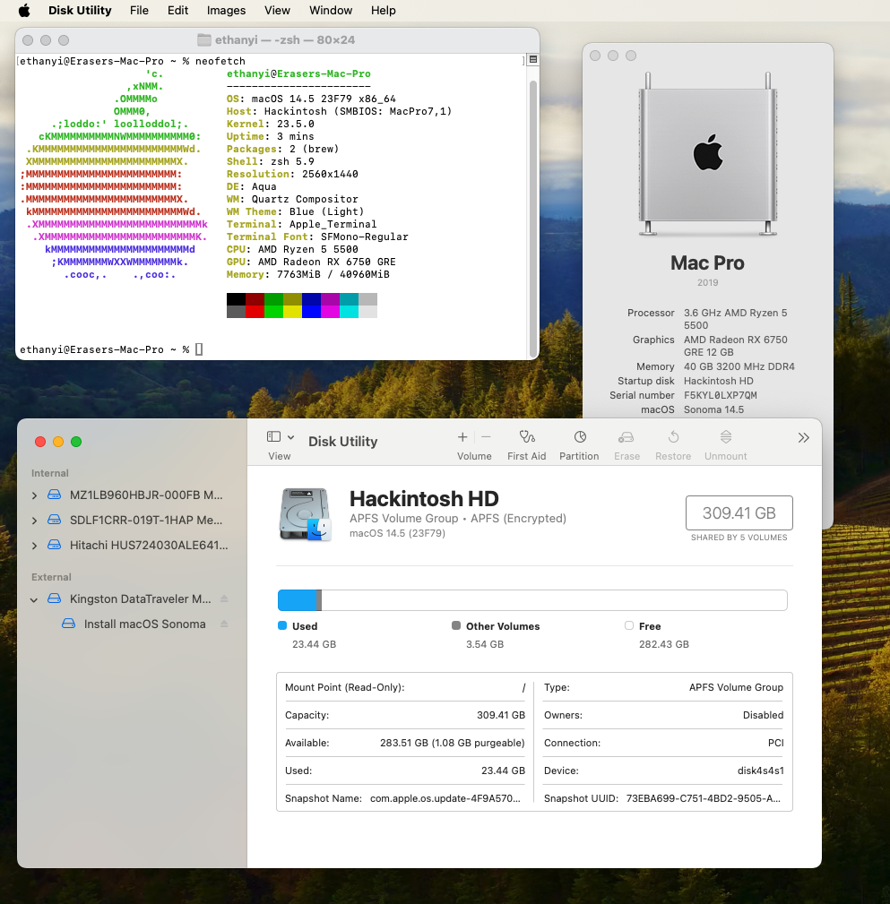
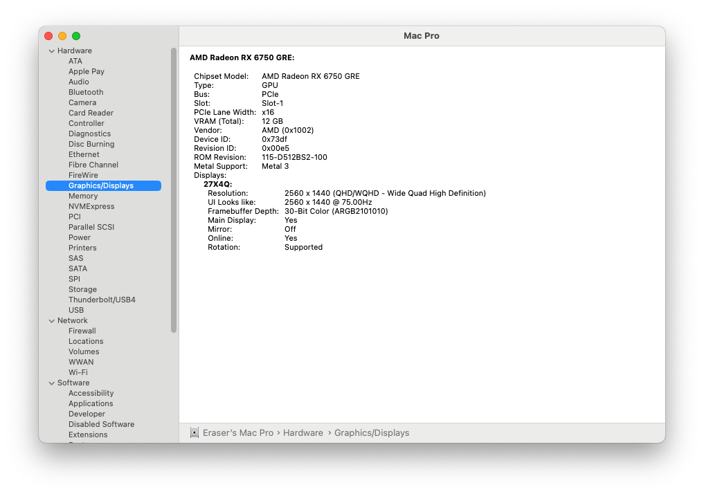

# B450M-Hackintosh
AMD B450 Hackintosh  EFI Files based on Opencore. Tested for macOS Monterey 12.1 &amp; Ventura 13&amp;Sonoma 14 

# Screenshots

# My Hardware
Components | Recommended
------------ | -------------
**Motherboard** | MSI B450M-A PRO MAX
**CPU** | Six Core AMD Ryzen 5 5500
**WiFi** | RTL8811CU USB WiFi Card
**Ethernet** | RTL8111
**Graphics Card** | AMD Radeon RX6750GRE 12GB
**RAM** | 1x 32GB  DDR4 3200 MHz
**RAM** | 1x 8GB  DDR4 3200 MHz
**macOS** | 12.1-14.5
**OpenCore** | v0.9.9
# What's Working?
- All USB Ports
- Ethernet
- WiFi
- Hiberation
- Dedicated Graphics Card
- HDMI/DP Output
- iMessage, FaceTime, Apple ID, iCloud, etc.
- Metal accelaration
# What's Not Working?
- Display device location in FindMy. (Requires a Broadcom WiFi Card)
- AirDrop, SideCar, Continuity. (Requires a Broadcom WiFi Card)
# What's Untested?
- Sound output via Board
- Sound output via HDMI/DP
(I only use this machine as a server so I've forgotten to test that.)

# Important Notice, Read before You Download the EFI Files⚠️⚠️⚠️

### **1.** Make sure the config matches your installed CPU cores
- Default config files are made for six core Processors such as my R5-5500, if you're on a CPU with different cores, plase change the value of 'Replace' in  'Force cpuid_cores_per_package' into the table listed below.
- 
| Cores | Value|
|-|-|
|   4 Core  | `uAQAAAAA` `ugQAAAAA` `ugQAAACQ` `ugQAAAA=`|
|   6 Core  | `uAYAAAAA` `ugYAAAAA` `ugYAAACQ` `ugYAAAA=` (Default)|
|   8 Core  | `uAgAAAAA` `uggAAAAA` `uggAAACQ` `uggAAAA=`|
|   12 Core | `uAwAAAAA` `ugwAAAAA` `ugwAAACQ` `ugwAAAA=`|
|   16 Core | `uBAAAAAA` `uhAAAAAA` `uhAAAACQ` `uhAAAAA=`|

### **2.** Regenerate the SMBIOS config to fix Apple Service

You **MUST** regenerate the SMBIOS config to make Apple Services working. We recommend MacPro 7,1 or iMac 20,1.

