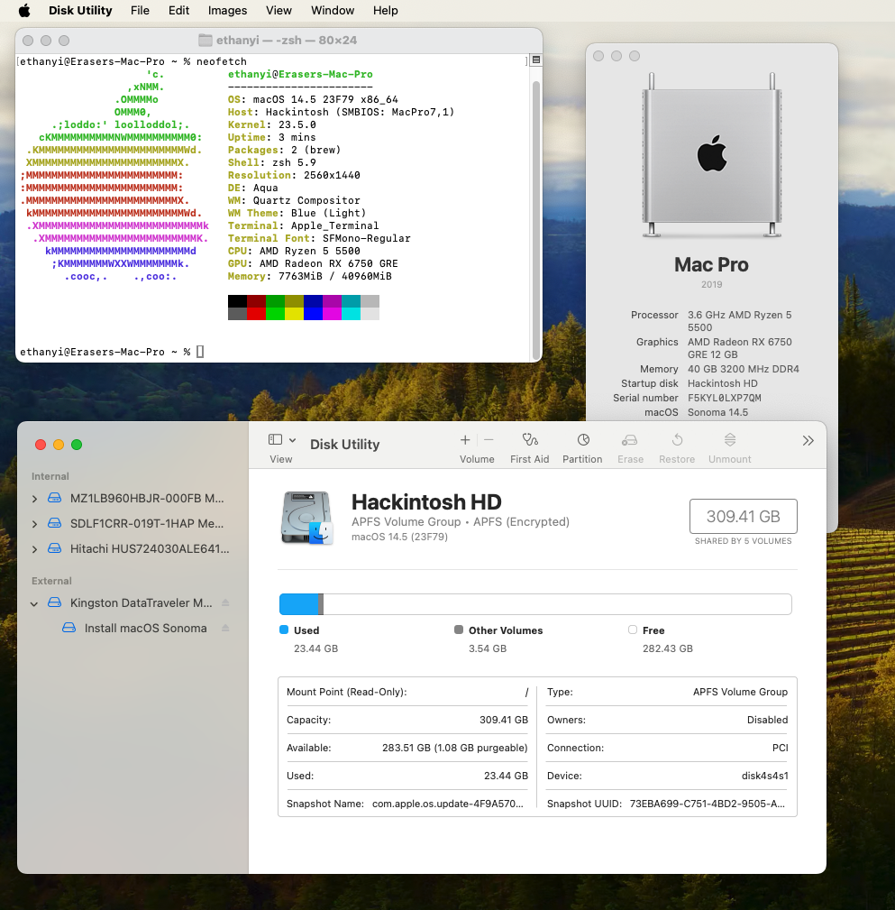
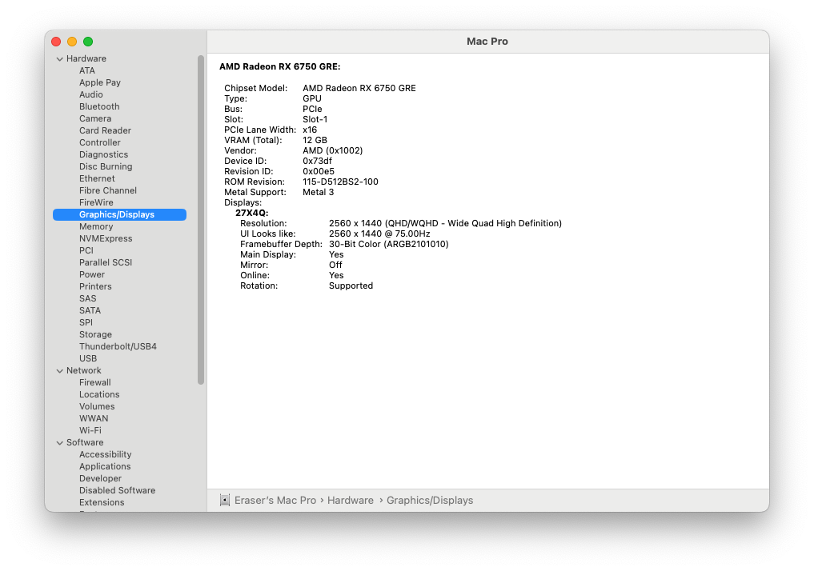

# B450M-Hackintosh

基于 Opencore 的 AMD B450 Hackintosh EFI 文件，已在 macOS Monterey 12.1 以及 Ventura 13 和 Sonoma 14 上进行了测试。

此branch仅适用于苹果官方不适配的一部分rDNA2架构显卡,具体指RX67xx, RX68xx,RX69xx等.[点击此处查看本branch是否适用您的显卡](https://chefkissinc.github.io/nootrx).若您使用Polaris/免驱rDNA2显卡,请切换到[此处](https://github.com/EraserCN/B450M-Hackintosh/blob/master/中文说明.md)

# 截图

# 我的硬件
组件 | 推荐配置  
--- | ---  
**主板** | MSI B450M-A PRO MAX  
**CPU** | 六核 AMD Ryzen 5 5500  
**WiFi** | RTL8811CU USB WiFi 卡  
**以太网** | RTL8111  
**显卡** | AMD Radeon RX6750GRE 12GB 
**内存** | 1x 32GB DDR4 3200 MHz  
**内存** | 1x 8GB DDR4 3200 MHz  
**macOS** | 11.0-14.4.1（使用 RX580）, 12.1-14.4.1（使用 RX6600）  
**OpenCore** | v0.9.9

# 有哪些功能是正常的？
- 所有 USB 接口
- 以太网
- WiFi
- 休眠
- 独立显卡
- HDMI/DP 输出
- iMessage, FaceTime, Apple ID, iCloud 等
- Metal 加速

# 有哪些功能是不正常的？
- 在 FindMy 中显示设备位置（需要使用 Broadcom WiFi 卡）
- AirDrop, SideCar, Continuity（需要使用 Broadcom WiFi 卡）

# 未测试的功能
- 主板音频输出
- HDMI/DP 音频输出
（由于我只将此设备用作服务器，所以未测试这些功能。）

# 重要通知，请在下载 EFI 文件之前阅读⚠️⚠️⚠️

### **1.** 确保配置文件匹配您已安装的 CPU 核心数
- 默认的配置文件适用于六核处理器，如我的 R5-5500。如果您的 CPU 核心数不同，请在 'Force cpuid_cores_per_package' 中将 'Replace' 的数值修改为下表中的值。

| 核心数 | 数值|  
|-|-|  
|   4 核  | `uAQAAAAA` `ugQAAAAA` `ugQAAACQ` `ugQAAAA=`|  
|   6 核  | `uAYAAAAA` `ugYAAAAA` `ugYAAACQ` `ugYAAAA=` (默认)|  
|   8 核  | `uAgAAAAA` `uggAAAAA` `uggAAACQ` `uggAAAA=`|  
|   12 核 | `uAwAAAAA` `ugwAAAAA` `ugwAAACQ` `ugwAAAA=`|  
|   16 核 | `uBAAAAAA` `uhAAAAAA` `uhAAAACQ` `uhAAAAA=`|

### **2.** 重生成 SMBIOS 配置以修复 Apple 服务

您**必须**重生成 SMBIOS 配置以使 Apple 服务正常运行。我们推荐使用 MacPro 7,1 或 iMac 20,1。

